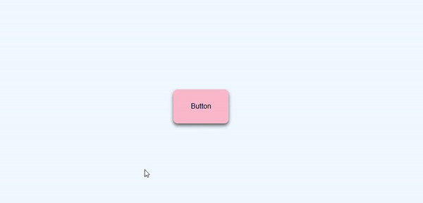

# Button Ripple Effect

This project demonstrates a button with a ripple effect using HTML, CSS, and JavaScript. When you hover over the button, a circular ripple effect expands from the mouse position.

## Demo


## Features

- Centered button with ripple effect on hover
- Smooth transitions for the ripple effect
- Customizable colors and sizes

## Installation
To run this project locally, follow these steps:

1. Clone the repository:
```sh
git clone https://github.com/PrabathIshanka/button-ripple-effect.git
```

2. Navigate to the project directory:
```sh
cd button-ripple-effect
```

## Usage
Open the `index.html` file in your web browser to view the auto text effect animation.

### File Structure

### index.html
```html
<!DOCTYPE html>
<html lang="en">
  <head>
    <meta charset="UTF-8" />
    <meta name="viewport" content="width=device-width, initial-scale=1.0" />
    <title>Button Ripple Effect</title>
    <link rel="stylesheet" href="style.css" />
  </head>
  <body>
    <a href="#" class="btn"><span>Button</span></a>
    <script src="app.js"></script>
  </body>
</html>

```
### app.js
```js
// Select the button element with the class 'btn'
const btn = document.querySelector(".btn");

// Add an event listener for the 'mouseover' event
btn.addEventListener("mouseover", (event) => {
  // Calculate the x and y positions relative to the button's position
  const x = event.pageX - btn.offsetLeft;
  const y = event.pageY - btn.offsetTop;

  // Set the CSS custom properties (--xPos and --yPos) with the calculated positions
  btn.style.setProperty("--xPos", `${x}px`);
  btn.style.setProperty("--yPos", `${y}px`);
});
```
### style.css
```css
/* Reset default margin and set up a flex container for centering */
body {
  margin: 0;
  display: flex;
  justify-content: center; /* Center horizontally */
  align-items: center; /* Center vertically */
  height: 100vh; /* Full viewport height */
  font-family: sans-serif; /* Apply a sans-serif font */
  background-color: aliceblue; /* Light blue background */
}

/* Style for the button */
.btn {
  background-color: pink; /* Pink background color */
  padding: 30px 40px; /* Padding around the text */
  border-radius: 10px; /* Rounded corners */
  box-shadow: 0 5px 8px rgba(0, 0, 0, 0.6); /* Drop shadow effect */
  text-decoration: none; /* Remove underline from links */
  color: black; /* Black text color */
  position: relative; /* Needed for the pseudo-element positioning */
  overflow: hidden; /* Hide overflow from pseudo-element */
}

/* Ensures the button text is above the pseudo-element */
.btn span {
  position: relative;
  z-index: 1; /* Places the text above the pseudo-element */
}

/* Initial state of the pseudo-element */
.btn::before {
  content: ""; /* Empty content for the pseudo-element */
  position: absolute; /* Absolute positioning relative to the button */
  background-color: orange; /* Orange background color */
  height: 0; /* Initial height */
  width: 0; /* Initial width */
  border-radius: 50px; /* Rounded shape */
  left: var(--xPos); /* X-coordinate from custom property */
  top: var(--yPos); /* Y-coordinate from custom property */
  transform: translate(-50%, -50%); /* Center the pseudo-element */
  transition: width 0.5s, height 0.5s; /* Smooth transition for width and height */
}

/* Expand the pseudo-element on hover */
.btn:hover::before {
  width: 300px; /* Expanded width */
  height: 300px; /* Expanded height */
}

```
